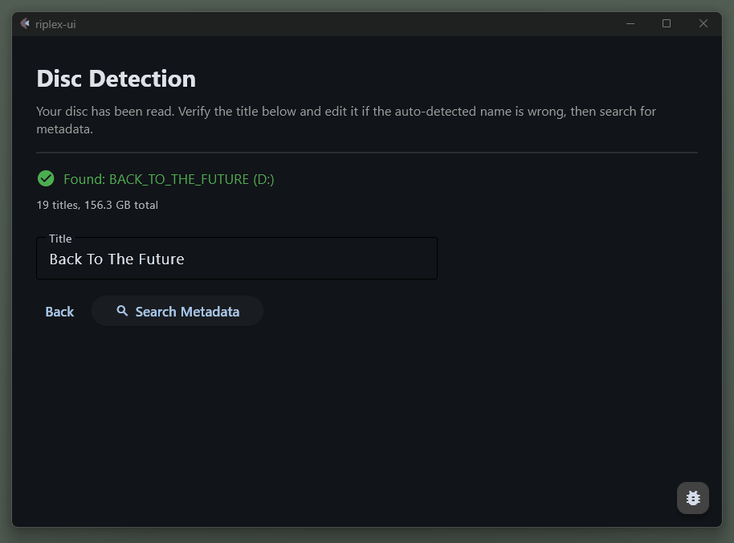
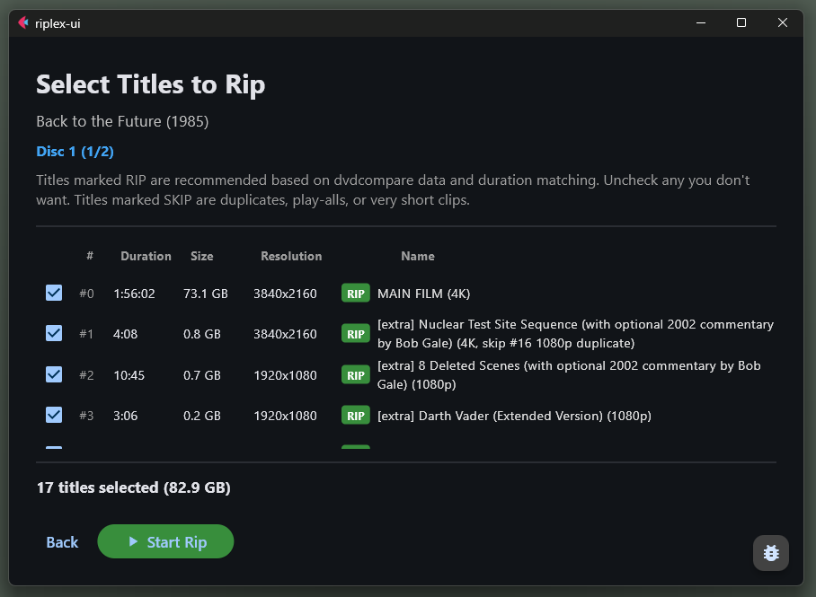

# riplex

Automatically organizes MKV files from physical disc collections into Plex-compatible folder structures with the right names, the right folders, and no manual work.

	

## Why?

After using MakeMKV to back up a disc, you're left with a pile of generically-named files (`title_t00.mkv`, `title_t01.mkv`, ...) and no idea which is the main film, which are featurettes, which are duplicates, and which is the play-all compilation you didn't need. For a multi-disc TV series, you're looking at hours of manual effort: reading disc cases, Googling runtimes, renaming files one by one, and building the exact folder hierarchy Plex demands.

riplex solves this by pulling metadata from TMDb (canonical titles, years, episode info) and [dvdcompare.net](https://www.dvdcompare.net) (per-disc content breakdowns including featurettes, deleted scenes, runtimes), then automatically classifying, deduplicating, matching, renaming, and organizing everything into the correct Plex structure.

## Get started

Start with the [Getting Started guide](docs/getting-started/installation.md). It covers all three install paths:

- **Pre-built app**: fastest way to try riplex. Download links and platform-specific notes are in the [installation guide](docs/getting-started/installation.md#option-a-pre-built-executables).
- **pipx**: recommended if you have Python or do not mind installing it. See [Option B](docs/getting-started/installation.md#option-b-install-with-pipx-recommended).
- **From source**: for developers and unsupported binary platforms. See [Option C](docs/getting-started/installation.md#option-c-install-from-source).

If you just want the desktop app right now, the latest binaries are on the [Releases page](https://github.com/AnyCredit5518/riplex/releases/latest).

After installing:

1. Run setup. The GUI walks you through it on first launch, or you can use [`riplex setup`](docs/getting-started/installation.md#setup).
2. If you want to see the GUI step by step, read the [GUI Walkthrough](docs/gui-guide/gui-walkthrough.md).
3. Follow the [CLI Workflow guide](docs/cli-guide/workflow.md) for the end-to-end flow.
4. If you prefer the terminal, use the [CLI reference](docs/reference/cli.md) for command details.

## What it looks like

Instead of leaving you to sort through a wall of raw MakeMKV titles, riplex helps you understand what is actually on the disc and choose the titles worth ripping. It surfaces likely matches, highlights junk and duplicates, and helps you avoid play-all traps.

More screenshots:
[welcome](screenshots/1_Welcome_Screen.png),
[disc detection](screenshots/2_Disc_Detection_BTTF.png),
[metadata lookup](screenshots/3_Metadata_Lookup_BTTF.png),
[release picker](screenshots/4_Disc_Release_BTTF.png),
[disc overview](screenshots/5_Multi_Disc_Overview_BTTF.png).

> [!NOTE]
> riplex currently handles one film (or one TV show) per session. Multi-film box sets that bundle separate films onto separate discs (e.g. a trilogy in one box) need to be ripped one film at a time.

## Requirements

riplex uses MakeMKV, ffmpeg, and MKVToolNix under the hood. The setup wizard installs them for you on Windows (winget), macOS (Homebrew), and Debian/Ubuntu Linux (apt). On other platforms see [the installation guide](docs/getting-started/installation.md).

You'll also need a free [TMDb API key](https://www.themoviedb.org/settings/api). The wizard prompts you for it.

## Data sources

- **[TMDb](https://www.themoviedb.org/)**: canonical movie and TV metadata (titles, years, episodes, runtimes)
- **[dvdcompare.net](https://www.dvdcompare.net)**: per-disc content breakdowns (featurettes, deleted scenes, play-all groupings, runtimes). An invaluable community resource.

## Related projects

- **[dvdcompare-scraper](https://github.com/AnyCredit5518/dvdcompare-scraper)**: Python client for dvdcompare.net. Powers riplex's disc lookup. Contributions welcome.

## Documentation

- [Getting started](docs/getting-started/installation.md): installation, configuration
- [GUI walkthrough](docs/gui-guide/gui-walkthrough.md): the main desktop flow, screen by screen
- [CLI workflow](docs/cli-guide/workflow.md): end-to-end terminal workflows
- [CLI reference](docs/reference/cli.md): every command and flag
- [Architecture](docs/architecture.md): design, data flow, project structure

## License

MIT
