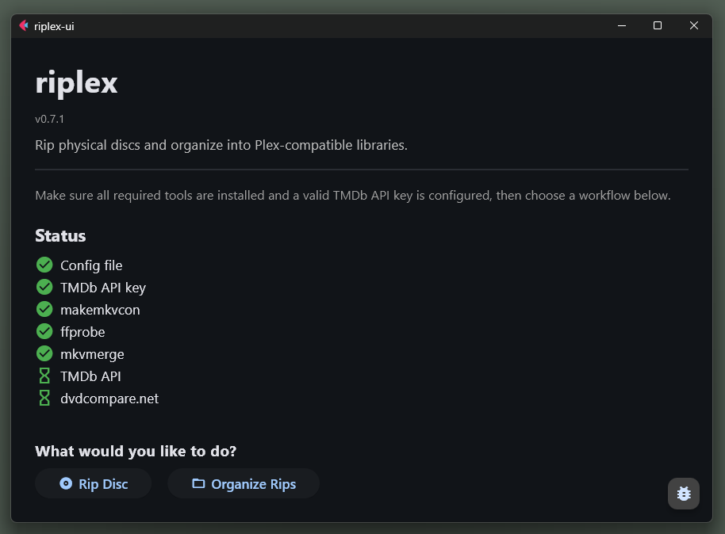
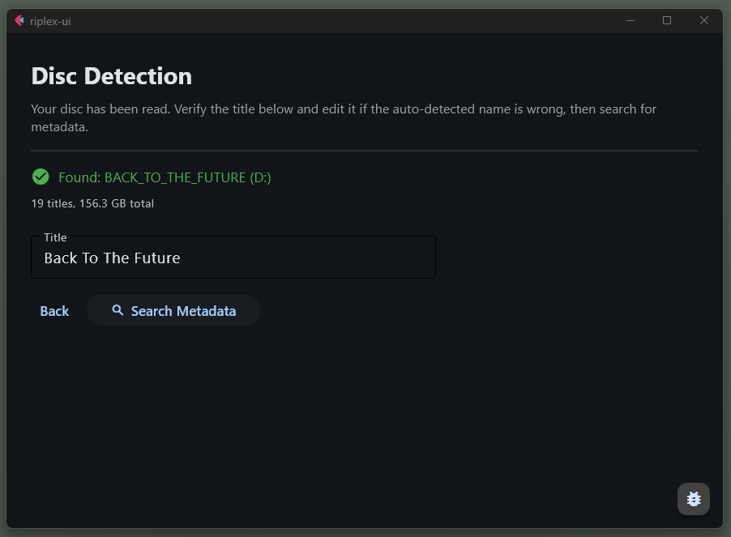
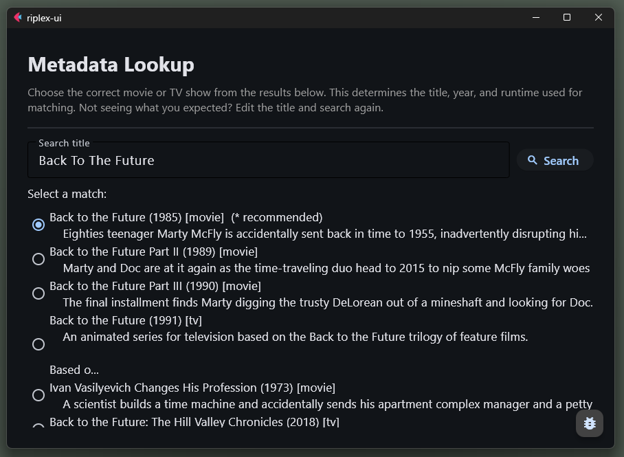
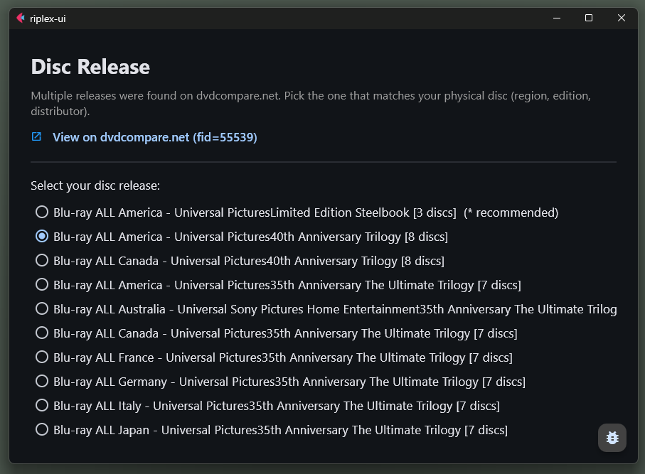
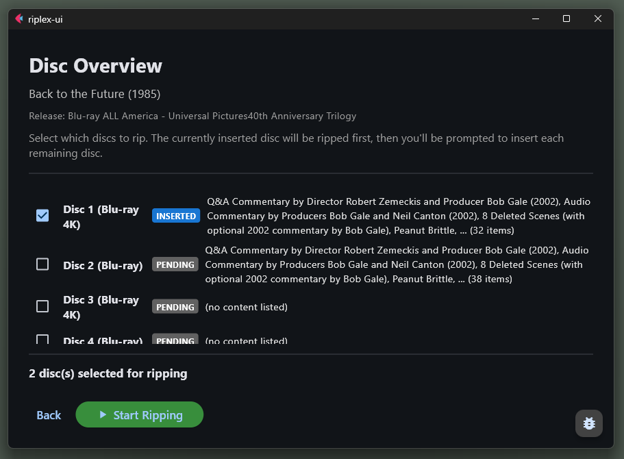

# GUI Walkthrough

This page walks through the main riplex GUI flow using the screenshots in this repo. It is not a screen-by-screen reference manual. The goal is to show what each step is for, what decision you make there, and what happens next.

## 1. Welcome

The Welcome screen checks your setup before you start. If riplex is missing a required tool or configuration value, this is where it tells you.

What you do here:
- confirm that your TMDb key and output paths are configured
- let riplex install or point to missing tools if needed
- continue once the environment is ready

## 2. Disc detection

Once a disc is in the drive, riplex detects it and reads the volume label.

What you do here:
- verify that the detected disc is the one you intended to rip
- if multiple drives are present, choose the correct drive
- continue once the disc has been read successfully

Troubleshooting:
- if no drive appears, verify that MakeMKV can see the drive and that `makemkvcon` is installed correctly
- if the detected title is wrong, you can correct it on the next step

## 3. Metadata lookup

riplex uses the disc label as a starting point, then looks up the title on TMDb.

What you do here:
- confirm the detected title if it is already correct
- edit the search text if the disc label is abbreviated or noisy
- choose the correct TMDb match if there is more than one possible result

## 4. Release picker

After the TMDb title is confirmed, riplex looks up the corresponding physical-media release on dvdcompare.net.

What you do here:
- pick the release that matches the disc in your drive
- pay attention to format and region when several similar releases exist
- use the dvdcompare link to verify the page if needed

Troubleshooting:
- if riplex picks the wrong dvdcompare page, use the manual override on this screen to paste a dvdcompare film id or URL

## 5. Title selection

This is the most important decision point in the GUI. riplex analyzes the disc, classifies the titles, and shows you what is likely worth ripping.

What you do here:
- review the recommended titles before starting the rip
- keep the main feature, episodes, or useful extras selected
- deselect obvious junk, duplicates, or play-all titles if needed

Why this screen matters:
- MakeMKV exposes raw titles and durations, but not what those titles actually are
- riplex uses metadata, disc context, and runtime matching to turn that pile of titles into something understandable

## 6. Disc overview for multi-disc releases

When a single film release spans multiple discs, riplex keeps them together as one project and shows you where the current disc fits into the full release.

What you do here:
- confirm that you are ripping the expected disc in the set
- move through the discs in order as riplex prompts you
- let riplex merge the results into one organized output when the project is complete

Important note:
- riplex currently handles one film or one TV show per session
- multi-film box sets still need to be ripped one film at a time

## What comes next

After title selection, riplex starts the rip, shows progress, and then summarizes the results when it finishes.

If you want the full end-to-end terminal flow after setup, see the [CLI Workflow](../cli-guide/workflow.md).
